# EEG-Creativity
This work builds on a study from [Jia and Zeng (2021) published in Nature Scientific Reports](https://www.nature.com/articles/s41598-021-81655-0) where EEG data was collected from subjects performing tasks related to idea generation, idea evolution, and idea evaluation. The study demonstrated that there were some differences in signal between tasks that were consistent across subjects. In this work, I test machine learning-based classification methods to determine what task/creative mode of thinking a subject is in from their EEG signal. Traditional machine learning methods using features mentioned in the original study were explored. However, I found that reframing this as an image classification problem with a spectrogram representation of the EEG signal was far more effective. Using convolutional neural networks on 10-second chunks of EEG signal represented as spectrograms, 82% test accuracy was achieved in identifying the creative mode of thinking.

# Code
Experiments conducted for this analysis including dataset generation, feature extraction, modeling, and interpretation can be found in the `experiments.ipynb` notebook.

# Documentation
An in-depth write-up can be found in `Paper.pdf`.

# Project Overview
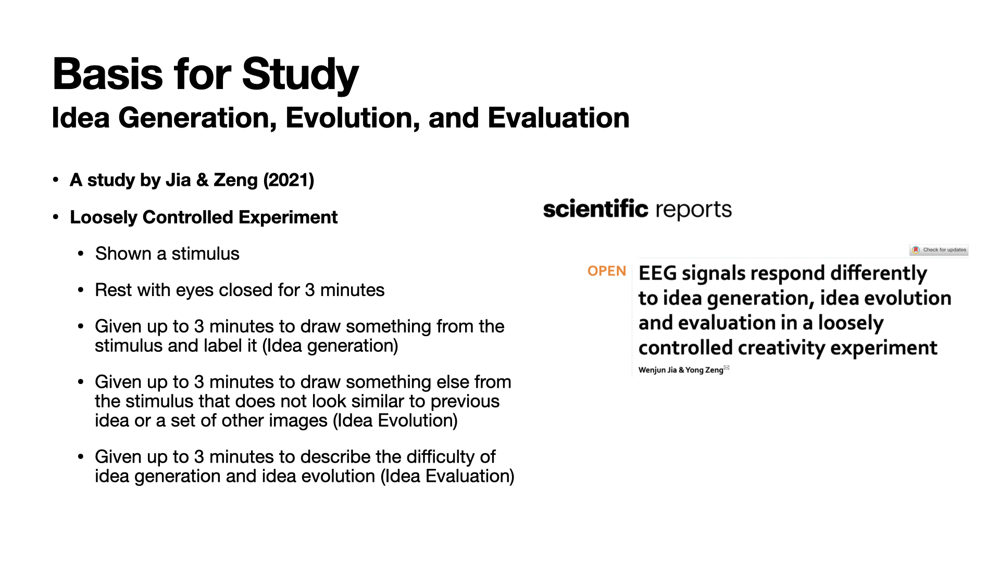

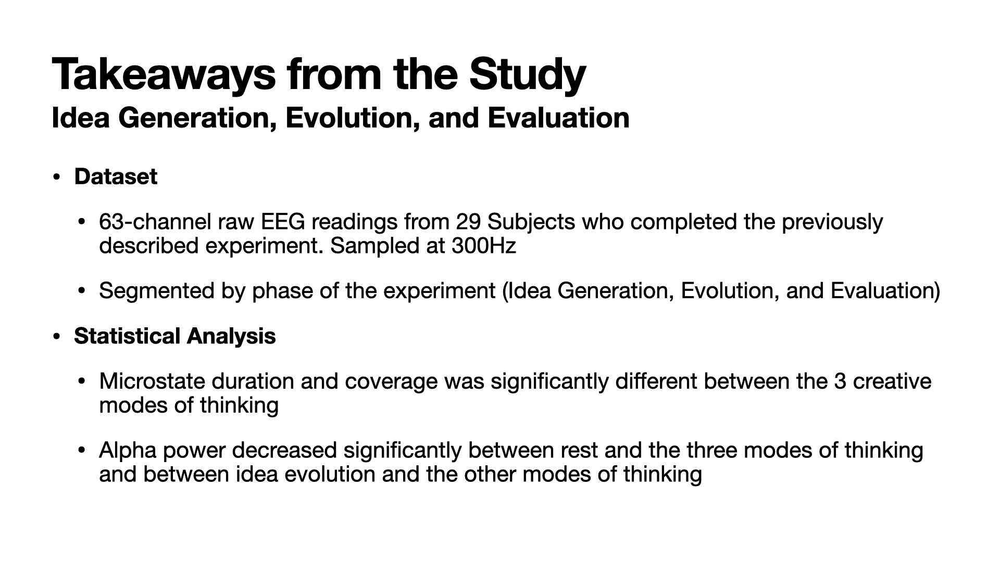
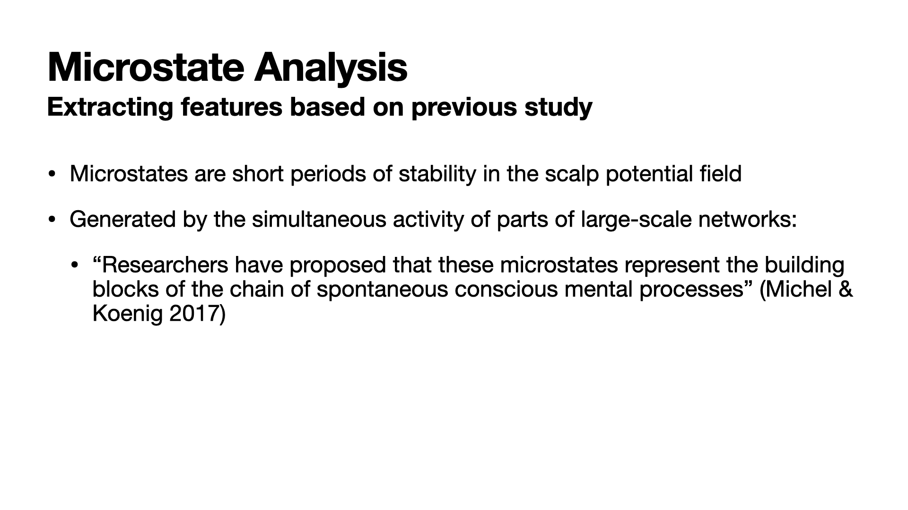
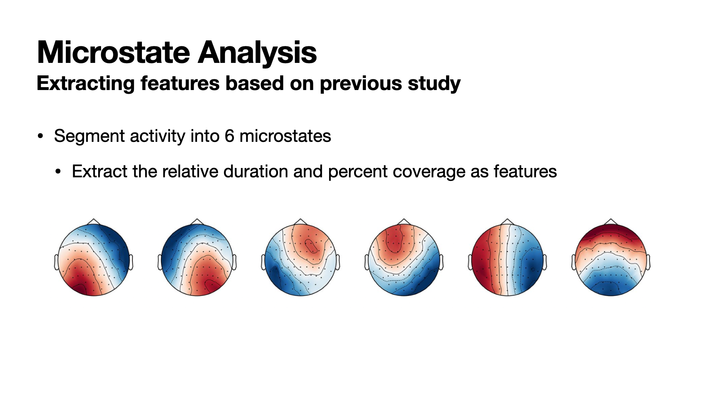
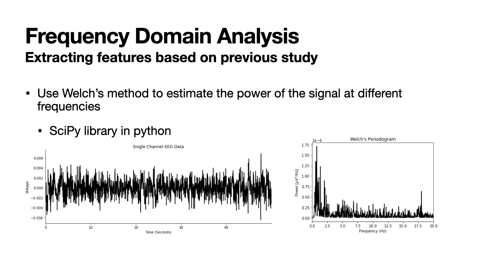
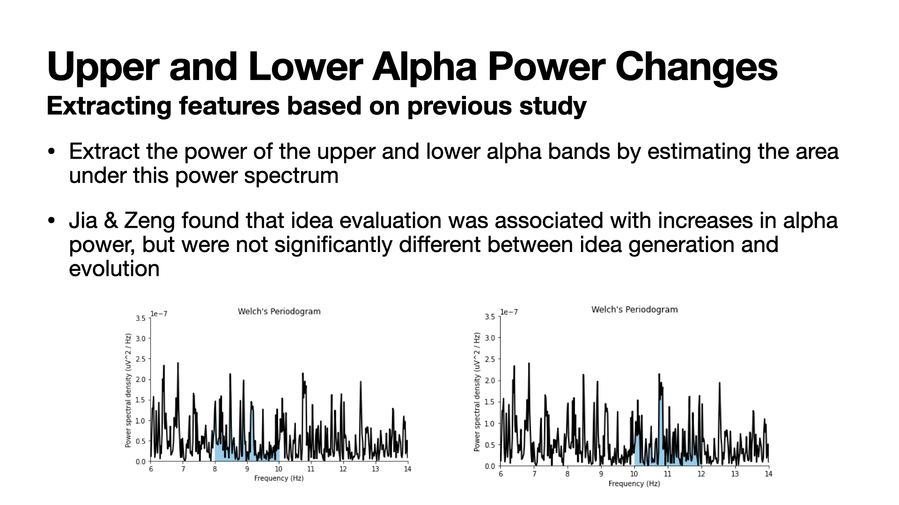
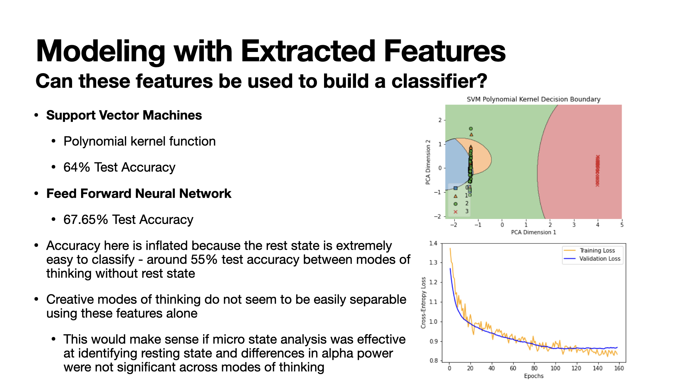
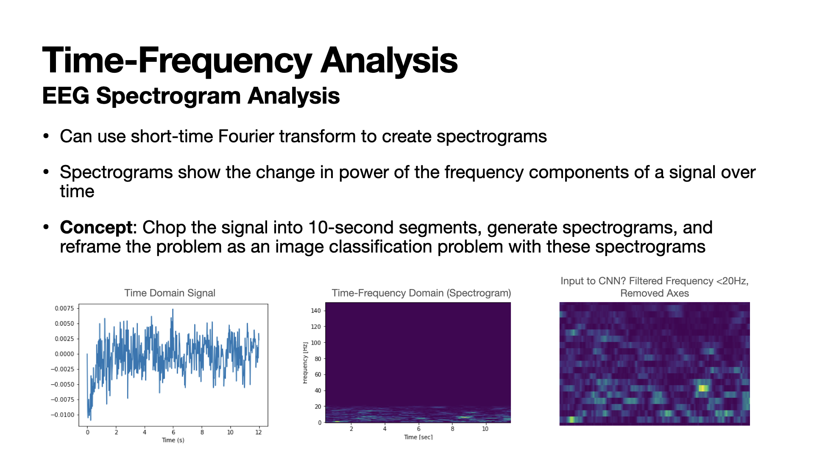
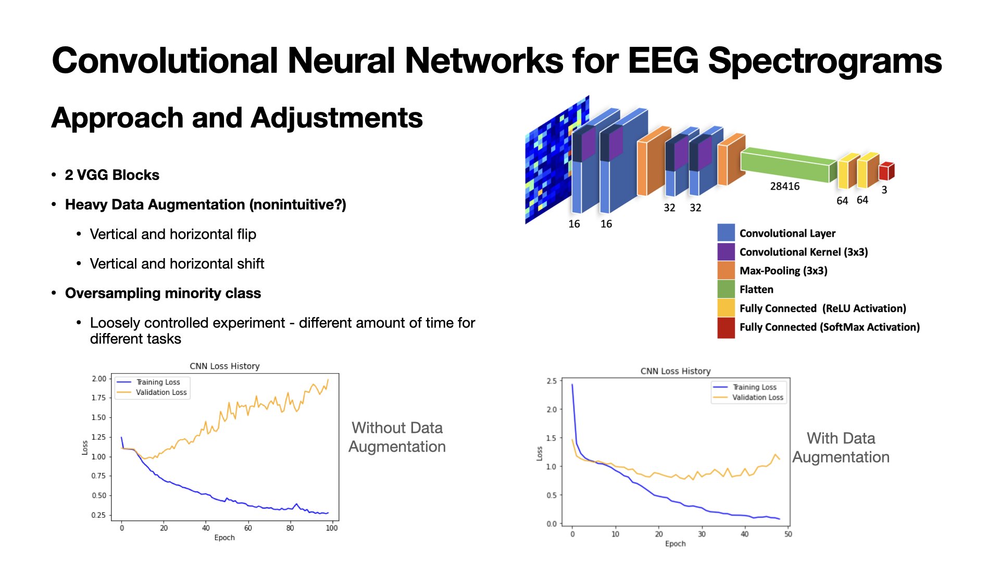
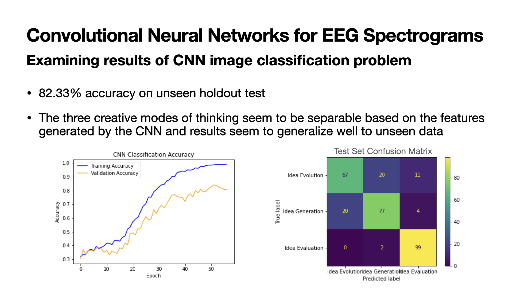

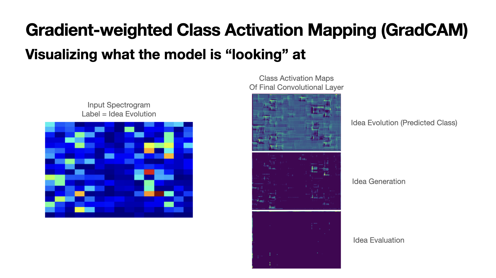
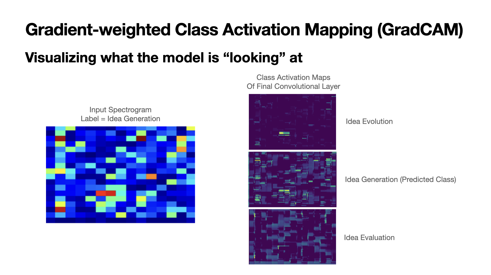
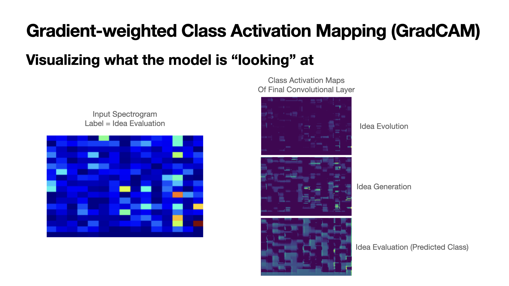
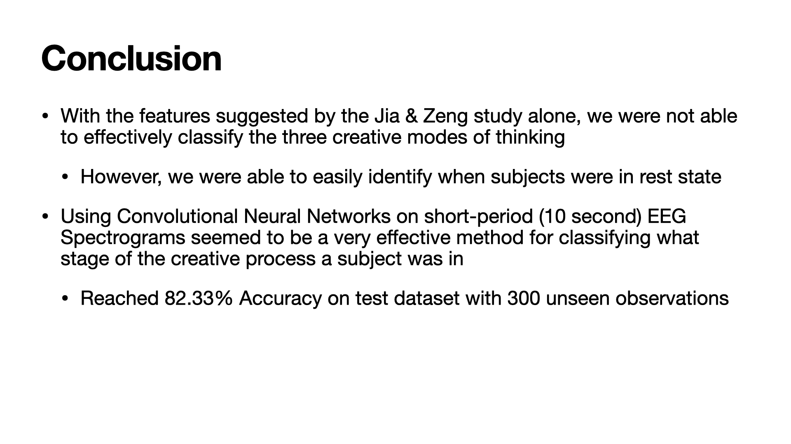
